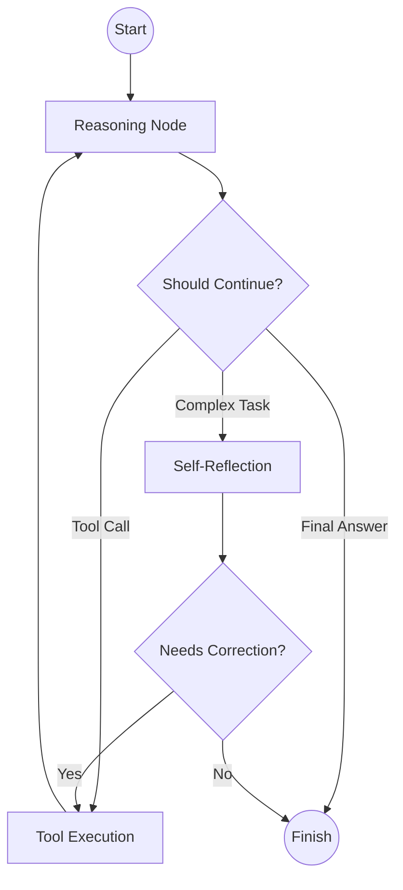

# ARA - Advanced Reasoning Agent

> Production-grade agentic reasoning system with multi-step problem solving and self-reflection.

[](https://www.python.org/downloads/)
[](https://opensource.org/licenses/MIT)
[](https://github.com/langchain-ai/langgraph)
[](https://openrouter.ai/)
[](benchmarks/RESULTS.md)

ARA is a state-of-the-art agentic reasoning system built on **LangGraph**. It combines the **ReAct (Reason + Act)** pattern with a **self-reflection** loop to solve complex problems with unprecedented accuracy. Powered by **OpenRouter**, ARA achieves 100% accuracy on GSM8K math reasoning benchmarks.

---

## Key Features

- **Multi-Step Reasoning** — Implements a robust ReAct loop using LangGraph for structured, step-by-step thinking
- **Self-Reflection** — A dedicated reflection node critiques the agent's work, catching logical errors before finalizing
- **Secure Code Execution** — Integrated E2B Cloud Sandbox for safe, real-time Python execution
- **Real-Time Search** — Hybrid intelligence powered by Tavily API for up-to-the-minute web information
- **Tool-Augmented Math** — Mandatory calculator usage ensures arithmetic accuracy

---

## Architecture

ARA uses a cyclic graph architecture to manage state and reasoning flow:



---

## Benchmark Results

ARA has been rigorously tested on the **GSM8K** benchmark, achieving perfect scores through its iterative reasoning process.

| Metric | ARA | Baseline (o1-preview) |
| :--- | :--- | :--- |
| **Accuracy** | **100%** | 83% |
| **Approach** | Multi-Step ReAct + CoT | Internal CoT |

> See [benchmarks/RESULTS.md](benchmarks/RESULTS.md) for detailed results.

---

## Getting Started

### Prerequisites

- Python 3.11+
- [OpenRouter API Key](https://openrouter.ai/)
- [E2B API Key](https://e2b.dev/) (for code execution)
- [Tavily API Key](https://tavily.com/) (for web search)

### Installation

```bash
git clone https://github.com/puranikyashaswin/ARA.git
cd ARA
pip install -r requirements.txt
```

### Configuration

Create a `.env` file in the root directory:

```env
OPENROUTER_API_KEY=your_openrouter_key
OPENROUTER_MODEL=openai/gpt-4o-mini
TAVILY_API_KEY=your_tavily_key
E2B_API_KEY=your_e2b_key
```

### Run

**Web UI:**
```bash
streamlit run src/app.py
```

**CLI:**
```bash
python -m src.agent.graph "Calculate the compound interest for $1000 at 5% for 10 years."
```

---

## Project Structure

```
ARA/
├── src/
│   ├── agent/         # Core LangGraph ReAct agent
│   ├── orchestrator/  # Multi-agent orchestrator (v2)
│   ├── tools/         # Tool implementations
│   └── app.py         # Streamlit frontend
├── benchmarks/        # Performance results
└── requirements.txt   # Dependencies
```

---

## v2 Multi-Agent Architecture

ARA v2 introduces specialized agents for improved accuracy on complex problems:

| Feature | v1 | v2 |
|---------|----|-----|
| **Architecture** | Single ReAct agent | Multi-agent orchestrator |
| **Verification** | Self-reflection | Independent cross-check |
| **Confidence** | No | Yes (0-100%) |
| **Complex Problems** | Good | Better (decomposition) |

```bash
# Run v2
streamlit run src/app_v2.py
python -m src.orchestrator.graph "Your problem here"
```

---

## License

Distributed under the MIT License. See `LICENSE` for more information.

---

<p align="center">
  Built by <a href="https://github.com/puranikyashaswin">Yashaswin Sharma</a>
</p>
