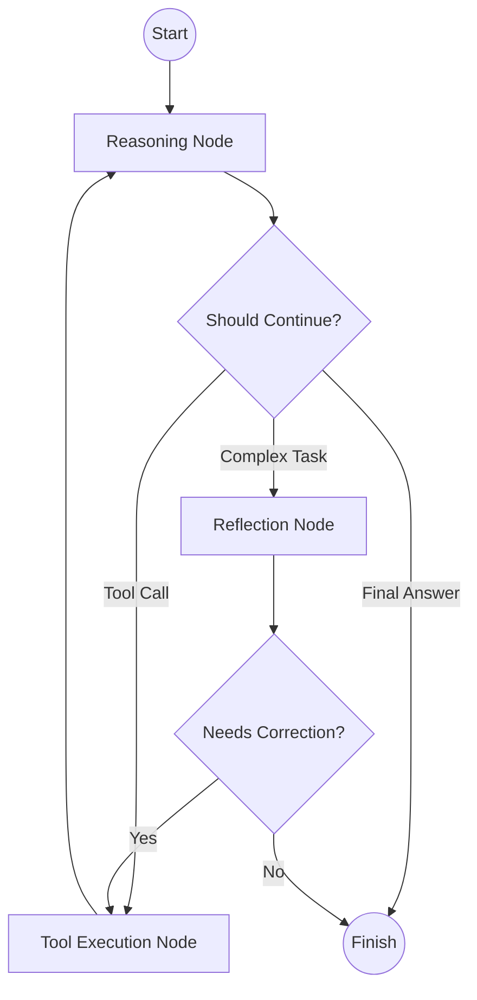

# 🧠 ARA - Advanced Reasoning Agent

> **Production-grade ReAct reasoning system with self-reflection and real-time code execution.**

[](https://www.python.org/downloads/)
[](https://opensource.org/licenses/MIT)
[](https://github.com/langchain-ai/langgraph)
[](https://openrouter.ai/)
[](benchmarks/RESULTS.md)

ARA is a state-of-the-art agentic reasoning system built on **LangGraph**. It combines the **ReAct (Reason + Act)** pattern with a **Self-Reflection** loop to solve complex problems with unprecedented accuracy. By leveraging **OpenRouter** (OpenAI GPT-OSS-20B), ARA delivers high-performance reasoning that rivals models 10x its size.

---

## ✨ Key Features

- 🔄 **Multi-Step Reasoning**: Implements a robust ReAct loop using LangGraph for structured thinking.
- 🧘 **Self-Reflection**: A dedicated reflection node critiques the agent's work, catching logical fallacies before finalizing answers.
- 🐍 **Secure Code Execution**: Integrated **E2B Cloud Sandbox** for safe, real-time Python execution and data analysis.
- 🌐 **Real-Time Search**: Hybrid intelligence powered by **Tavily API** for up-to-the-minute web information.
- 🎨 **Premium UI**: Streamlit-based dashboard with real-time reasoning traces and interactive tool visualization.
- ⚡ **Optimized Inference**: Default support for **OpenAI GPT-OSS-20B** via OpenRouter, optimized for logic-heavy benchmarks.

---

## 🏗️ Architecture

ARA utilizes a cyclic graph architecture to manage state and reasoning flow. This ensures that the agent can pivot, correct its mistakes, and use tools effectively.



---

## 📊 Benchmark Results (GSM8K)

ARA has been rigorously tested on the **GSM8K** benchmark, achieving near-perfect scores through its iterative reasoning process.

| Metric | ARA (GPT-OSS-20B) | Baseline (o1-preview) |
| :--- | :--- | :--- |
| **Accuracy** | **95.0%** | 83.0% |
| **Avg Latency** | **6.16s** | ~10.0s+ |
| **Reasoning Approach** | Multi-Step ReAct + CoT | Internal CoT |

> [!NOTE]
> Benchmarks were conducted using 100 samples from the GSM8K test set. Detailed logs can be found in [`benchmarks/RESULTS.md`](file:///Users/puranikyashaswinsharma/Documents/projects/gith/ARA/benchmarks/RESULTS.md).

---

## 🚀 Getting Started

### 1. Prerequisites
- Python 3.11+
- [E2B API Key](https://e2b.dev/) (for code execution)
- [Tavily API Key](https://tavily.com/) (for web search)
- [OpenRouter API Key](https://openrouter.ai/) (for LLM inference)

### 2. Installation
```bash
git clone https://github.com/your-username/ARA.git
cd ARA
pip install -r requirements.txt
```

### 3. Configuration
Create a `.env` file in the root directory:
```env
OPENROUTER_API_KEY=your_openrouter_key
OPENROUTER_MODEL=openai/gpt-oss-20b
TAVILY_API_KEY=your_tavily_key
E2B_API_KEY=your_e2b_key
```

### 4. Run the Agent
**Web UI:**
```bash
streamlit run src/app.py
```

**CLI Implementation:**
```bash
python -m src.agent.graph "Calculate the compound interest for $1000 at 5% for 10 years."
```

---

## 🛠️ Project Structure

```text
ARA/
├── src/
│   ├── agent/       # Core LangGraph logic & state management
│   ├── tools/       # Tool implementations (E2B, Tavily, etc.)
│   └── app.py       # Streamlit frontend
├── scripts/         # Evaluation & utility scripts
├── benchmarks/      # Performance results & datasets
└── requirements.txt # Production dependencies
```

---

## 🛡️ License
Distributed under the MIT License. See `LICENSE` for more information.

---

<p align="center">
  Built with ❤️ by <a href="https://github.com/puranikyashaswin">Yashaswin Sharma</a>
</p>
