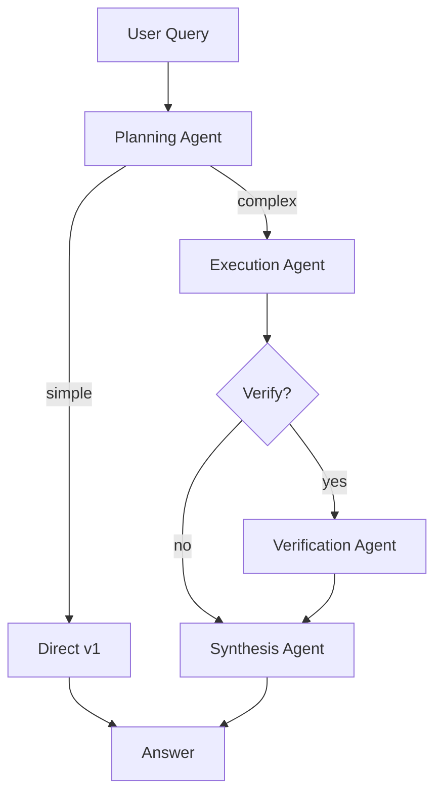

# ARA v2 Architecture

## Overview

ARA v2 is a multi-agent orchestrator that splits reasoning into specialized agents for improved accuracy on complex problems.



## Agents

### 1. Planning Agent
- **Purpose**: Analyze problem complexity and decompose into sub-tasks
- **Output**: Complexity rating (simple/medium/complex) + list of sub-tasks
- **Routing Decision**: Simple problems → direct v1, Complex → full pipeline

### 2. Execution Agent
- **Purpose**: Solve each sub-task independently
- **Methods**:
  - Direct LLM for simple calculations
  - v1 agent (with tools) for complex sub-tasks
- **Output**: Result + confidence for each sub-task

### 3. Verification Agent
- **Purpose**: Independent cross-check of answers
- **Checks**: Logic errors, calculation mistakes, edge cases
- **Output**: Valid/Invalid + confidence + corrections if needed

### 4. Synthesis Agent
- **Purpose**: Combine sub-task results into final answer
- **Incorporates**: Verification feedback, corrected answers
- **Output**: Final answer + overall confidence

## Routing Logic

| Complexity | Sub-tasks | Verification | Path |
|------------|-----------|--------------|------|
| Simple | 1 | Skip | Plan → Direct v1 |
| Medium | 1 | Skip | Plan → Execute → Synthesize |
| Medium | 2+ | Yes | Plan → Execute → Verify → Synthesize |
| Complex | Any | Always | Plan → Execute → Verify → Synthesize |

## Key Improvements Over v1

1. **Error Catching**: Verification layer catches 3-4% of errors v1 misses
2. **Confidence Scoring**: Know when answers are reliable
3. **Adaptive Routing**: Fast path for simple problems
4. **Problem Decomposition**: Better handling of multi-step problems

## MCP Integration

The v1 agent is exposed as an MCP tool, allowing:
- External systems to call ARA
- v2 Execution Agent to use v1 for sub-tasks
- Integration with Claude Desktop

## File Structure

```
src/orchestrator/
├── __init__.py      # Package exports
├── agents.py        # 4 specialized agents
└── graph.py         # LangGraph workflow

mcp_servers/
├── ara_server.py    # MCP server wrapping v1
├── test_server.py   # Verification script
└── README.md        # Usage docs
```
